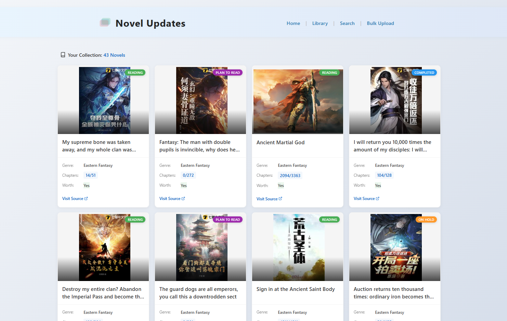
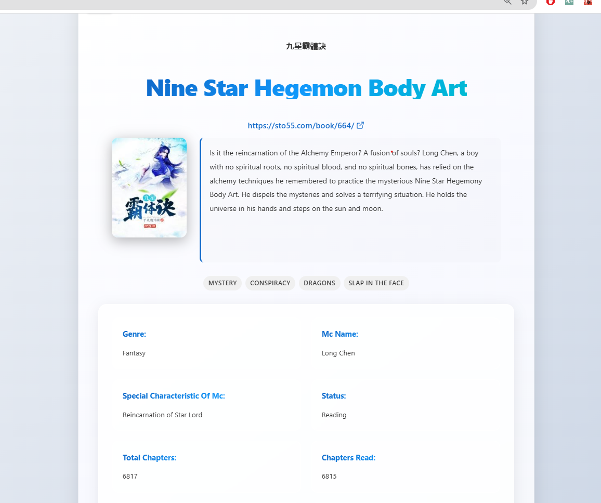

# Novel Library

A comprehensive web application for managing, tracking, and organizing your novel reading collection.  
Built with React (Vite) for the frontend and backed by a RESTful API.




## Features

### Core Functionality

- Add new novels with extensive details (name, original name, genre, etc.)
- Modern card-based library view with cover images
- Detailed novel pages with comprehensive information
- Edit and update novel information any time

### Reading Management

- Track reading progress (chapters read/total)
- Mark novels as Reading, Completed, Dropped, On Hold, or Plan to Read
- "Worth to Continue" indicators to remember if novels are worth your time
- Favorite/bookmark novels for quick access

### User Experience

- Dark mode and light mode support
- Responsive design for all device sizes
- Pagination for browsing large collections
- Image handling with automatic fallbacks
- Tags system for better categorization

## Getting Started

### Prerequisites

- Node.js (v16+ recommended)
- npm

### Installation

1. Clone the repository:

   ```
   git clone https://github.com/vikasyadav17/Novel-management-frontend.git
   cd Novel-management-frontend
   ```

2. Install dependencies:

   ```
   npm install
   ```

3. Start the development server:

   ```
   npm run dev
   ```

4. Open [http://localhost:5173](http://localhost:5173) in your browser.

### Backend

This frontend expects a backend running at `http://localhost:8080/novels`.  
Make sure your backend API is running and accessible.

## Environment Setup

The application uses environment variables for configuration. Follow these steps to set it up:

1. Copy the `.env.example` file to `.env`:

   ```
   cp .env.example .env
   ```

2. Edit the `.env` file to match your environment:

   ```
   VITE_API_BASE_URL=http://localhost:8080/novels
   ```

3. Restart the development server if it's already running:
   ```
   npm run dev
   ```

## Project Structure

- `src/components/` – React components (NovelCard, NovelForm, NovelHeader, etc.)
- `src/pages/` – Page components (Library, NovelDetails, Home)
- `src/services/` – API service for backend communication
- `src/context/` – React contexts for theme and global state
- `src/hooks/` – Custom hooks for novel editing and data management
- `src/utils/` – Utility functions for field configuration and data manipulation
- `src/styles/` – CSS and styling utilities
- `src/assets/` – Images and static assets

## Usage Guide

### Adding a Novel

1. Navigate to "Add Novel" page
2. Fill in the required fields (name, genre)
3. Add optional details like cover image URL, description, tags
4. Submit the form

### Tracking Reading Progress

1. Open a novel's detail page
2. Edit the novel
3. Update "Chapters Read" and "Total Chapters"
4. Set the "Status" field to track your progress

### Managing Favorites

- Click the bookmark icon on any novel detail page to add/remove from favorites
- Access your favorites collection from the favorites page

## Customization

- Update API endpoints in `src/services/novelApi.js` if your backend URL changes
- Modify themes in `src/context/ThemeContext.jsx` for custom color schemes
- Add new field types in `src/utils/fieldConfig.js` for additional data fields

## Contributing

Contributions are welcome! Please feel free to submit a Pull Request.

## License

This project is licensed under the MIT License - see the LICENSE file for details.

### Screenshot Gallery

<!-- <div align="center">
  
  <p><em>Detailed view of a novel showing all information</em></p>

  
  <p><em>The application in dark mode</em></p>

  
  <p><em>Form to add a new novel to your library</em></p>
</div> -->
